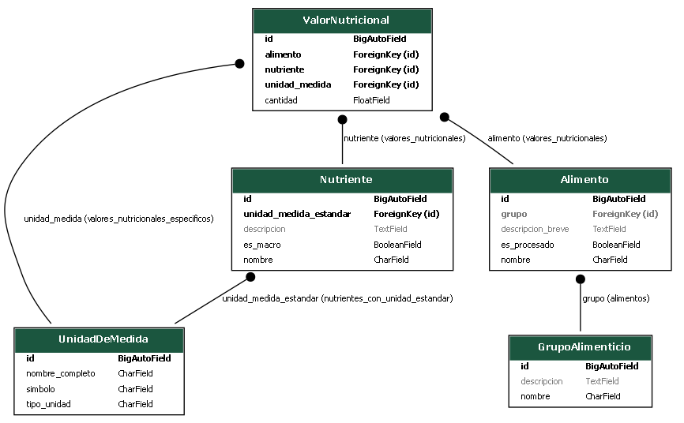

# PG2_Practica3

# Api Alimentos 

Esta API pública proporciona un conjunto de herramientas robustas para la gestión y consulta de datos relacionados con **alimentos, su composición nutricional, y sistemas de clasificación**. Está diseñada para ser una fuente centralizada de información sobre nutrición, ideal para ser integrada en aplicaciones móviles, web o de análisis de datos que requieran acceso a:

* **Detalles de Alimentos:** Información específica sobre una amplia variedad de alimentos, incluyendo su origen (procesado/no procesado), descripción y clasificación.
* **Composición Nutricional:** Datos precisos sobre la cantidad de diversos nutrientes (macronutrientes y micronutrientes) presentes en los alimentos, especificados por diferentes unidades de medida y cantidades de referencia.
* **Clasificaciones Estándar:** Gestión de unidades de medida (gramos, mililitros, calorías, etc.) y la organización de alimentos en grupos alimenticios (frutas, proteínas, vegetales, etc.) para facilitar la búsqueda y el análisis.

El principal objetivo de esta API es ofrecer una base de datos nutricional estructurada y de fácil acceso, que pueda ser utilizada para:
* Desarrollo de aplicaciones de seguimiento dietético y planificación de comidas.
* Creación de herramientas de análisis nutricional para profesionales de la salud.
* Población de catálogos de alimentos en plataformas de comercio electrónico o restaurantes.
* Proyectos de investigación y educación sobre hábitos alimenticios.

# Diagrama de modelos 
Aca nuestro objetivo es hacer un diagrama de entidad relacion, para eso necesitamos sacar las entidades, atributos y relaciones de nuestra Api, para eso antes tenemos que creear nuestro enterno virtual y activarlo

# Crear entorno virtual
```bash
python -m venv env
```
# Activar entorno

```bash
.\env\Scripts\activate
```

Despues creamos el archivo requirements.txt

# Dentro el archivo

```python
django == 5.2
django-extensions == 4.1
djangorestframework == 3.16.0
 ```

# Crea proecto Django

```bash
django-admin startproject apisenderismo
```

# Iniciamos la app

```bash
python manage.py startapp ruta
```

y con esto ya se nos habran creado varios archivos dentro de el nomber de apisenderismo y ruta, dentro del archivo ruta, buscamos un archivo .py que diga models y dentro de ahi ponemos las entidades de nuestra Api junto con sus atributos y relaciones

# Ejemplo del archivo models
```python
class Alimento(models.Model):
    nombre = models.CharField(max_length=100, unique=True, verbose_name="Nombre del Alimento")
    descripcion_breve = models.TextField(blank=True, null=True, verbose_name="Descripción Breve")
    imagen_url = models.URLField(blank=True, null=True, verbose_name="URL de Imagen")
    es_procesado = models.BooleanField(default=False, verbose_name="Es Procesado")
    fuente_datos = models.CharField(max_length=100, verbose_name="Fuente de Datos")
    fecha_ultima_actualizacion = models.DateField(default=timezone.now, verbose_name="Fecha Última Actualización")
    grupo = models.ForeignKey(
        GrupoAlimenticio,
        on_delete=models.SET_NULL,
        blank=True,
        null=True,
        related_name='alimentos', 
        verbose_name="Grupo Alimenticio"
    )

class Nutriente(models.Model):
    nombre = models.CharField(max_length=100, unique=True, verbose_name="Nombre del Nutriente")
    descripcion = models.TextField(blank=True, null=True, verbose_name="Descripción")
    es_macro = models.BooleanField(default=False, verbose_name="Es Macronutriente")
    unidad_medida_estandar = models.ForeignKey(
        UnidadDeMedida,
        on_delete=models.PROTECT,
        related_name='nutrientes_con_unidad_estandar', 
        verbose_name="Unidad de Medida Estándar"
    )
```

Despues de haber hecho nos valos al archivo que creamos con el nombre de nuestra Apin en este caso apisenderismo y dentro de ahi buscamos el archivo .py llamados setting y ademas de eso agregaremos una apartado llamado graph_models: 

# Installed Apps
```python 
    'django_extensions',
    'rest_framework',
    'rest_framework.authtoken',
    'ruta',
De momento usaremos dos de estas extensiones que estamos agregando y mas tarde usaremos los otros dos
```

Agregamos debajo de installed apps:

# GRAPH_MODELS
```python
GRAPH_MODELS = {
    'app_labels': ['ruta'],
}
```

Despues de esto ya lo tendriamos listo todo pero antes tenemos que instalar algunas dependencias para que pueda graficar el diagrama 

# INSTALAT DEPENDENCIAS
```bash
pip install pydotplus
pip install django_extensions 
pip install graphviz
```

# Ejecutar el comando para el grafico
```bash
python manage.py graph_models ruta -o diagrama.png
```


# Diagrama de entidad relacion 

 


# Referencia de Endpoints de la API de Alimentos

Esta documentación detalla los endpoints principales RESTful disponibles en la API de Alimentos, enfocándose en la recuperación de listas de recursos y sus filtros.

**Base URL de la API:** `http://127.0.0.1:8000/api/v1/`

---

## 1. Recurso: Unidades de Medida

* **Endpoint:** `/unidades-de-medida/`
* **Método:** `GET`
    * **Descripción:** Obtener una lista de todas las unidades de medida.
    * **Filtros (Parámetros de Consulta):**
        * `?search=<texto>`: Búsqueda en `nombre_completo`, `simbolo`, `tipo_unidad`.
    * **Ejemplo de Respuesta (200 OK):**
        ```json
        [
            { "id": 1, "simbolo": "g", "nombre_completo": "gramos", "tipo_unidad": "peso" }
        ]
        ```

---

## 2. Recurso: Grupos Alimenticios

* **Endpoint:** `/grupos-alimenticios/`
* **Método:** `GET`
    * **Descripción:** Listar todos los grupos alimenticios.
    * **Filtros (Parámetros de Consulta):**
        * `?search=<texto>`: Búsqueda en `nombre`, `descripcion`.
    * **Ejemplo de Respuesta (200 OK):**
        ```json
        [
            { "id": 1, "nombre": "Frutas", "descripcion": "Alimentos dulces..." }
        ]
        ```

---

## 3. Recurso: Alimentos

* **Endpoint:** `/alimentos/`
* **Método:** `GET`
    * **Descripción:** Listar todos los alimentos.
    * **Filtros (Parámetros de Consulta):**
        * `?search=<texto>`: Búsqueda en `nombre`, `descripcion_breve`, `fuente_datos`.
        * `?es_procesado=true/false`: Filtrar por si es procesado.
        * `?grupo=<id_grupo>`: Filtrar por el ID del grupo alimenticio.
    * **Ejemplo de Respuesta (200 OK):**
        ```json
        [
            { "id": 101, "nombre": "Manzana Roja", "es_procesado": false, "grupo": 1, "descripcion_breve": "Fruta crujiente y dulce"}
        ]
        ```

---

## 4. Recurso: Nutrientes

* **Endpoint:** `/nutrientes/`
* **Método:** `GET`
    * **Descripción:** Listar todos los nutrientes.
    * **Filtros (Parámetros de Consulta):**
        * `?search=<texto>`: Búsqueda en `nombre`, `descripcion`.
        * `?es_macro=true/false`: Filtrar por si es macronutriente.
        * `?unidad_medida_estandar=<id_unidad>`: Filtrar por la unidad de medida estándar.
    * **Ejemplo de Respuesta (200 OK):**
        ```json
        [
            { "id": 1, "nombre": "Proteínas", "es_macro": true, "unidad_medida_estandar": 1, "descripcion": "Macronutriente esencial para la construccion muscular" }
        ]
        ```

---

## 5. Recurso: Valores Nutricionales

* **Endpoint:** `/valores-nutricionales/`
* **Método:** `GET`
    * **Descripción:** Listar todos los valores nutricionales.
    * **Filtros (Parámetros de Consulta):**
        * `?alimento=<id_alimento>`, `?nutriente=<id_nutriente>`, `?unidad_medida=<id_unidad>`: Filtrar por IDs relacionados.
        * `?cantidad=<valor>`, `?cantidad_referencia=<valor>`, `?porcentaje_vd=<valor>`: Filtrar por valores exactos.
    * **Ejemplo de Respuesta (200 OK):**
        ```json
        [
            {
                "id": 1, "alimento": 101, "nutriente": 1, "unidad_medida": 1,
                "cantidad": 0.3
            }
        ]
        ```


# Ejemplo de Caso de Uso: Registrar un Nuevo Alimento y sus Nutrientes

Este ejemplo muestra una secuencia común de interacciones con la API para añadir un nuevo alimento y sus datos nutricionales.

**Objetivo:** Añadir "Kiwi Fresco" con su información nutricional.

**Pasos Clave:**

1.  **Preparar Datos de Referencia:**
    * Verificar o crear **Unidades de Medida** (ej., "gramos", "miligramos") usando `GET /api/v1/unidades-de-medida/` y `POST /api/v1/unidades-de-medida/`.
    * Verificar o crear **Grupos Alimenticios** (ej., "Frutas") usando `GET /api/v1/grupos-alimenticios/` y `POST /api/v1/grupos-alimenticios/`.
    * Verificar o crear **Nutrientes** (ej., "Vitamina C", "Fibra") usando `GET /api/v1/nutrientes/` y `POST /api/v1/nutrientes/`.

2.  **Crear el Alimento:**
    * **Endpoint:** `POST /api/v1/alimentos/`
    * **Cuerpo (JSON):**
        ```json
        {
            "nombre": "Kiwi Fresco",
            "descripcion_breve": "...",
            "es_procesado": false,
            "grupo": <id_grupo_frutas>
        }
        ```
    * **Resultado:** Obtener el `id` del nuevo alimento (ej., `205`).

3.  **Añadir Valores Nutricionales:**
    * **Endpoint:** `POST /api/v1/valores-nutricionales/` (repetir para cada nutriente).
    * **Cuerpo (JSON):**
        ```json
        {
            "alimento": 205, 
            "nutriente": <id_vitamina_c>,
            "unidad_medida": <id_miligramos>,
        }
        ```
    * **Resultado:** Registrar los detalles nutricionales para Vitamina C, Fibra, Azúcares, etc.

4.  **Verificar (Opcional):**
    * **Endpoint:** `GET /api/v1/alimentos/205/`
    * **Resultado:** Confirmar que "Kiwi Fresco" y sus relaciones nutricionales se muestran correctamente. (Nota: La inclusión de los valores nutricionales directamente en la respuesta del alimento depende de la configuración de tus serializers anidados).


# Ejemplo de Caso de Uso: Registrar un Nuevo Alimento "Pechuga de Pollo" y sus Nutrientes

Este ejemplo muestra una secuencia común de interacciones con la API para añadir un nuevo alimento (`"Pechuga de Pollo"`) y sus datos nutricionales detallados.

**Objetivo:** Añadir "Pechuga de Pollo" con su información nutricional.

**Pasos Clave:**

1.  **Preparar Datos de Referencia:**
    * Verificar o crear **Unidades de Medida** (ej., "gramos", "miligramos") usando `GET /api/v1/unidades-de-medida/` y `POST /api/v1/unidades-de-medida/`.
    * Verificar o crear **Grupos Alimenticios** (ej., "Carnes y Aves") usando `GET /api/v1/grupos-alimenticios/` y `POST /api/v1/grupos-alimenticios/`.
    * Verificar o crear **Nutrientes** (ej., "Proteínas", "Grasa", "Vitamina B3") usando `GET /api/v1/nutrientes/` y `POST /api/v1/nutrientes/`.

2.  **Crear el Alimento: "Pechuga de Pollo"**
    * **Endpoint:** `POST /api/v1/alimentos/`
    * **Cuerpo (JSON):**
        ```json
        {
            "nombre": "Pechuga de Pollo",
            "descripcion_breve": "Corte magro de carne de ave.",
            "es_procesado": false,
            "fuente_datos": "USDA FoodData Central",
            "grupo": "<id_grupo_carnes_aves>" 
        }
        ```
    * **Resultado:** Obtener el `id` del nuevo alimento (ej., `301`).

3.  **Añadir Valores Nutricionales para "Pechuga de Pollo":**
    * **Endpoint:** `POST /api/v1/valores-nutricionales/` (repetir para cada nutriente).
    * **Cuerpo (JSON) - Ejemplo para Proteínas:**
        ```json
        {
            "alimento": 301,                
            "nutriente": "<id_proteinas>",  
            "unidad_medida": "<id_gramos>", 
            "cantidad": 31.0,
        }
        ```
    * **Cuerpo (JSON) - Ejemplo para Grasa:**
        ```json
        {
            "alimento": 301,             
            "nutriente": "<id_grasa>",     
            "unidad_medida": "<id_gramos>",
            "cantidad": 3.6,
        }
        ```
    * **Resultado:** Registrar los detalles nutricionales para Proteínas, Grasa, etc.

4.  **Verificar (Opcional):**
    * **Endpoint:** `GET /api/v1/alimentos/301/`
    * **Resultado:** Confirmar que "Pechuga de Pollo" y sus relaciones nutricionales se muestran correctamente. (Nota: La inclusión de los valores nutricionales directamente en la respuesta del alimento depende de la configuración de tus serializers anidados).
---
